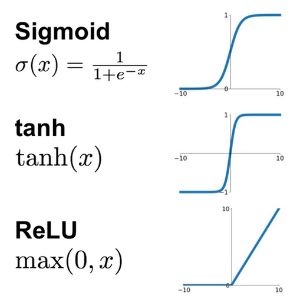

# FINN Layers

This document presents the different layers implemented by *FINN* and *Brevitas*, either by extension of the existing *PyTorch* layers or the new operators added.

#### Neural Network Layers

Neural network are composed of a lot of different layers and the main ones can be categorized under the following groups:

- **Convolution Layers:** Convolutions are operations that aims at extracting high-level features out of the image such as edges or important regions. 
- **Pooling Layers:** Pooling consists of a reduction of the spatial size by either keeping the maximum or average value of a given region. This is used to decrease the computational power required to process the data. It is also useful to extract dominant features. Max pooling will often perform better as it works as a noise suppressant.
- **Fully Connected Layers:** Fully connected layers help learning non-linear combinations of high-level features.

Neural network use these layers in combination with activation functions that can be applied on the result of a neuron before sending it to the next one. The most popular activation functions are *ReLU*, *Tanh* or *Sigmoid*.

Using non-linear activation functions allows the network to handle complex problems using only a small number of nodes.

#### PyTorch Layers

*PyTorch* whom *Brevitas* is built upon implements many different layers to translate any neural network into its Python representation. The layers are sorted by type and belong to the following categories:

- **Convolution Layers:** As explained earlier, the convolution operations help determine high-level features in regions of an image. They can be used in several dimensions and with their transposed alternative in *PyTorch*.
  - `Conv1d`, `Conv2d`, `Conv3d`, `ConvTranspose1d`, ...
  - `Fold`, `Unfold`
- **Pooling Layers:** As explained earlier, pooling layers work as *noise suppressants* or *spatial size reducers*. 
  - `MaxPool1d`, `MaxPool2d`, `MaxPool3d`, `AdaptativeMaxPool1d`, ...
  - `AvgPool1d`, ...
  - `MaxUnpool1d`, ...

- **Padding Layers:** Padding operations help in giving more importance to the border pixels because any convolution or pooling operation on a padded input will perform multiple times on the border pixels. Several possibilities come when discussing what to add on the padded borders.
  - `ReflectionPad1d`, `ReflectionPad2d`
  - `ReplicationPad1d`, `ReplicationPad2d`, ...
  - `ZeroPad2d`, `ConstantPad1d`, `ConstantPad2d`, ...
- **Normalization Layers:** Normalization has been introduced as a way to improve the speed, performance and stability of neural networks. It standardizes (mean of zero, standard deviation) the activations of the inputs of a layer. This normalization can be applied to a batch (or even mini-batch) of data but also to an instance or a wider group.
  - `BatchNorm1d`, `BatchNorm2d`, ``BatchNorm3d`
  - `InstanceNorm1d`, `InstanceNorm2d`, `InstanceNorm3d`
- **Recurrent Layers:**
- **Transformer Layers:**
- **Linear Layers:** Matrix multiplication layers (contains the *Fully Connected* layer for example).
  - `Identity`, `Linear`, `Bilinear`
- **Dropout Layers:**
- **Sparse Layers:**
- **Non-linear Activations:** The activation functions help in making the neural networks good performers for complex problems. The non-linearity brings the most out of the networks and can be represented by different functions.
  - `Tanh`, `Hardtanh`, `ReLU`, `Sigmoid`, ...
- **Distance Functions:**
- **Loss Functions:**

#### Brevitas Layers

*Brevitas* extends the *PyTorch* functionalities by creating layers where weights or activation values can hold values of less than 8 bits instead of the usual *floating point 32-bits* representations. 

#### FINN Transformations Layers

While performing the needed transformations to produce an *HLS-conversion-ready* network, *FINN* uses several custom operators in its work-flow. Some are used in early transformation and as a result of streamlining for example while others impact the actual execution of the network.

- **`Im2Col`:** This transformation modifies the input image or batch to an actual matrix 2-dimensions matrix. This operation is more beneficial than an actual convolution operation over a 3-dimensions image.
- **`StreamingDataflowPartition`:** This class corresponds to the meta/container node that is a placeholder for a group of `fpgadataflow` nodes that have been separated out into a *FINN-ONNX* model of its own. This partition is created by separating all nodes that are able to have an *HLS* translation and keeping the others in the parent graph.
- **`MaxPoolNHWC`:** This node corresponds to a `MaxPool` node using the *NHWC* data layout (`num_samples`, `height`, `width`, `channels`).
- **`XNORPopCountMatMul`:** Corresponds to an *XNOR-popcount* matrix multiplication as a regular *matrix multiplication*. This is made possible by the fact that binarized neural networks can simplify the matrix multiplication down to extremely simple operations such as *XNOR-popcount*.
- **`MultiThreshold`:** A multi-thresholding node is given a set of threshold values `t={t_0, t_1, ... , t_n}`. It maps any real number `x` to an integer in the interval `[0, n]`, where the returned integer is the number of thresholds `x` is greater than or equal to.

*FPGA Data Flow* layers are used later in the work flow and often consist of calls to back-end C++ function calls  

- **`StreamingFCLayer_Batch`:** Fully-connected layer implementation calling the corresponding function from *finn-hlslib*.
- **`StreamingMaxPool_Batch`:** Max-Pool implementation for binarized values calling the corresponding function from *finn-hlslib*.
- **`StreamingFIFO`:** This node is used 
- **`StreamingDataWidthConverter_Batch`** Converts the width of the input stream in the output stream. Used to upscale or downscale a stream without loss of data in the procedure.
- **`TLastMarker`: **